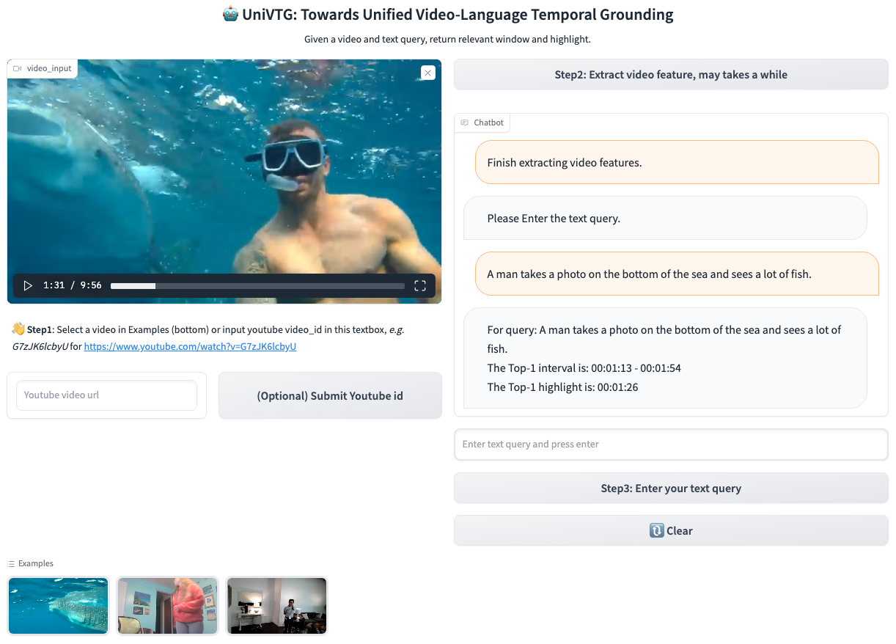
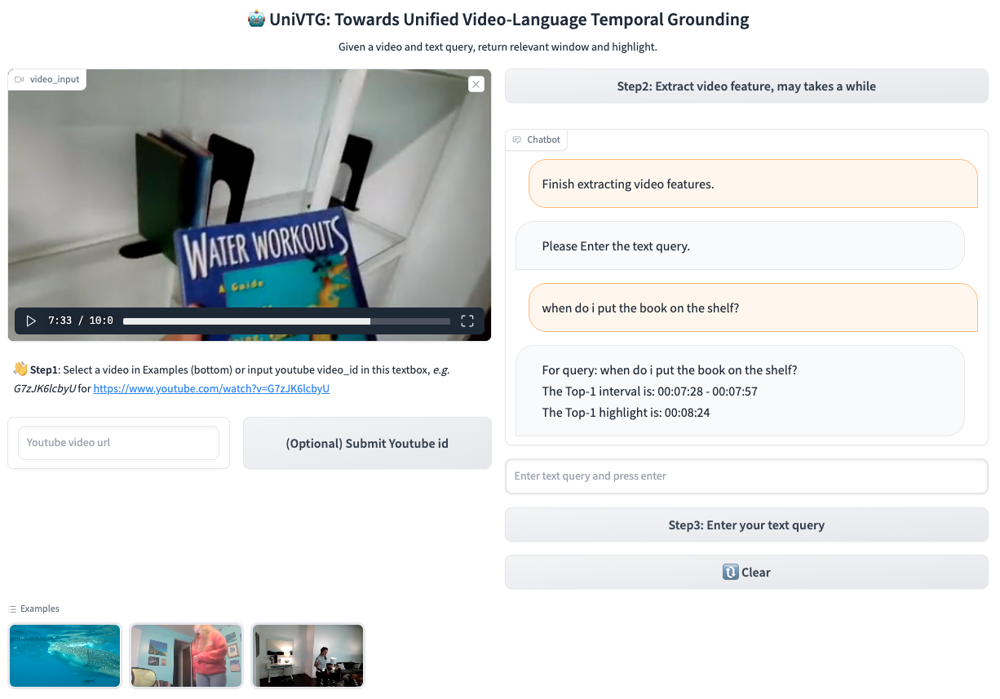
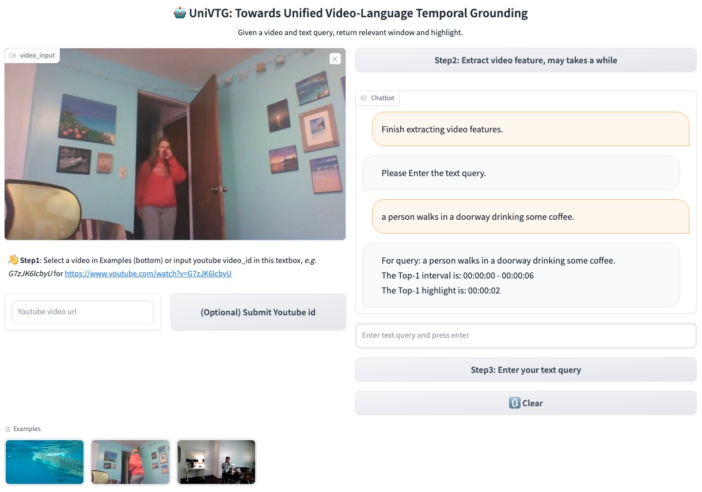
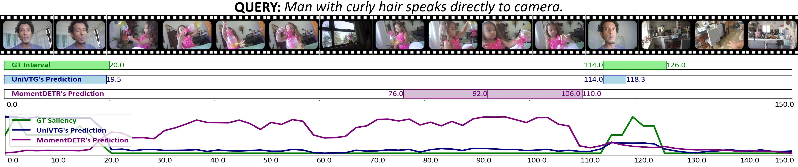

 # UniVTG (ICCV'23)
[](https://paperswithcode.com/sota/highlight-detection-on-qvhighlights?p=univtg-towards-unified-video-language) [](https://paperswithcode.com/sota/moment-retrieval-on-qvhighlights?p=univtg-towards-unified-video-language)

[[arXiv]](https://arxiv.org/abs/2307.16715) <a src="https://img.shields.io/badge/%F0%9F%A4%97-Open%20in%20Spaces-blue" href="https://huggingface.co/spaces/KevinQHLin/UniVTG">
    
<a src="https://img.shields.io/twitter/url?color=blue&label=Tweet&logo=twitter&url=https%3A%2F%2Ftwitter.com%2FKevinQHLin%2Fstatus%2F1649124447037841408" href="https://twitter.com/KevinQHLin/status/1686223119718006784">
    
</a>
 
> **TL; DR:** The first video temporal grounding pretraining model, unifying diverse temporal annotations to power moment retrieval (interval), highlight detection (curve) and video summarization (point).


### 📢 News
<!--  -->
- [2023.10.15] Upload the Clip teacher scripts to create scalable pseudo annotations.
- [2023.8.22] Code cleaning, add training/inference instruction, upload all downstream checkpoints.
- [2023.8.6] Create the [Huggingface space demo](https://huggingface.co/spaces/KevinQHLin/UniVTG)!
- [2023.7.31] We release the arXiv paper, codes, checkpoints, and gradio demo.

### 📝 Todo
- [ ] Connect UniVTG with LLM e.g., ChatGPT.
- [x] Upload all downstream checkpoints.
- [x] Upload all pretraining checkpoints.

## 🌟 Run on your video:
To power practical usage, we release the following checkpoints:

*can be run on a single GPU with less than 4GB memory, highly efficient, less than 1 sec to perform temporal grounding even a 10 minutes long video.*

> 
| Video Enc.  | Text Enc.  | Pretraining            | Fine-tuning   |  Checkpoints |
| ------------------ |  ------------------ | ------------------ | ------- | ---- |
| CLIP-B/16 | CLIP-B/16 | 4M      | -      |   [Google Drive](https://drive.google.com/drive/folders/1-eGata6ZPV0A1BBsZpYyIooos9yjMx2f?usp=sharing)  |
| CLIP-B/16 | CLIP-B/16 | 4M | QVHL + Charades + NLQ + TACoS + ActivityNet + DiDeMo      |  [Google Drive](https://drive.google.com/drive/folders/1l6RyjGuqkzfZryCC6xwTZsvjWaIMVxIO?usp=sharing)  

Download checkpoint and put it in the dir `results/omni`.

Download the example videos from [here](https://drive.google.com/drive/folders/1TpMYRmdAx5yx-lQu4ivCnAX67voUfBcL?usp=sharing) and put it under `examples/`

Run `python3 main_gradio.py --resume ./results/omni/model_best.ckpt`

<details open><summary>[ Youtube video ]</summary>
</details>
<details open><summary>[ Egocentric video ]</summary>
</details>
<details open><summary>[ Charades video  ]</summary>
</details>

## ⚙️ Preparation

Please find instructions in [install.md](install.md) to setup environment and datasets.

## 📦 Model Zoo

Download checkpoints in [model.md](model.md) to reproduce the benchmark results.

## 🚀 Training & Inference
> We use slurm for job running, you may need to slightly modify the code to adapt your environment if you do not use slurm system.
### Pretraining (multi-gpu)

Large-scale pretraining: `bash scripts/pretrain.sh`

Multi-datasets co-training: `bash scripts/cotrain.sh`

### Downstream (single-gpu)
*Indicate `--resume` to init model by pretraining weight. **Refer to our model zoo for detailed parameter settings***

Training: `bash scripts/qvhl_pretrain.sh`


*Indicate `--eval_init` and `--n_epoch=0` to evaluate selected checkpoint `--resume`.*

Inference: `bash scripts/qvhl_inference.sh`

### CLIP teacher to create scalable pseudo labels

1. Download the openimages v6 class list from `https://storage.googleapis.com/openimages/v6/oidv6-class-descriptions.csv`.

2. Convert it as json by `python3 teacher/csv2json.py` then extract the textual class features by `python3 teacher/label2feature.py`

3. (Before this, you should have extracted the video features of the video) Run the script to generate pseudo labels `python3 teacher/clip2labels.py`


## 🎨 Visualization

If you want to draw visualizations like our paper, you can simply run `python3 plot/qvhl.py` to generate corresponding figures by providing the prediction jsons (you can download them in [Model Zoo](https://github.com/showlab/UniVTG/blob/main/model.md)).



## 🎓 Citation
If you find our work helps, please cite our paper.

```
@misc{lin2023univtg,
      title={UniVTG: Towards Unified Video-Language Temporal Grounding}, 
      author={Kevin Qinghong Lin and Pengchuan Zhang and Joya Chen and Shraman Pramanick and Difei Gao and Alex Jinpeng Wang and Rui Yan and Mike Zheng Shou},
      year={2023},
      eprint={2307.16715},
      archivePrefix={arXiv},
      primaryClass={cs.CV}
}
```

## ✉️ Contact
This repo is maintained by [Kevin](https://qinghonglin.github.io/). Questions and discussions are welcome via kevin.qh.lin@gmail.com or open an issue.

## 😊 Acknowledgement

This codebase is based on [moment_detr](https://github.com/jayleicn/moment_detr), [HERO_Video_Feature_Extractor](https://github.com/linjieli222/HERO_Video_Feature_Extractor), [UMT](https://github.com/tencentarc/umt).

We thank the authors for their open-source contributions.

## LICENSE
MIT
