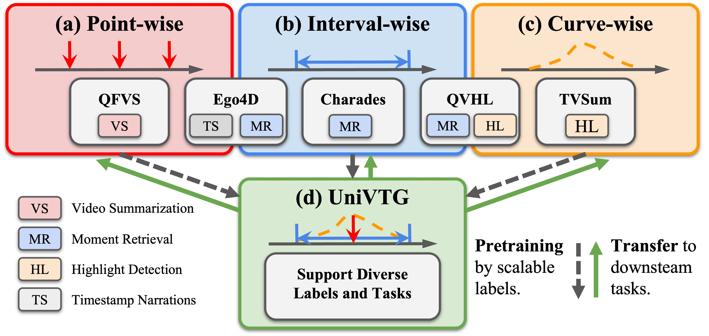
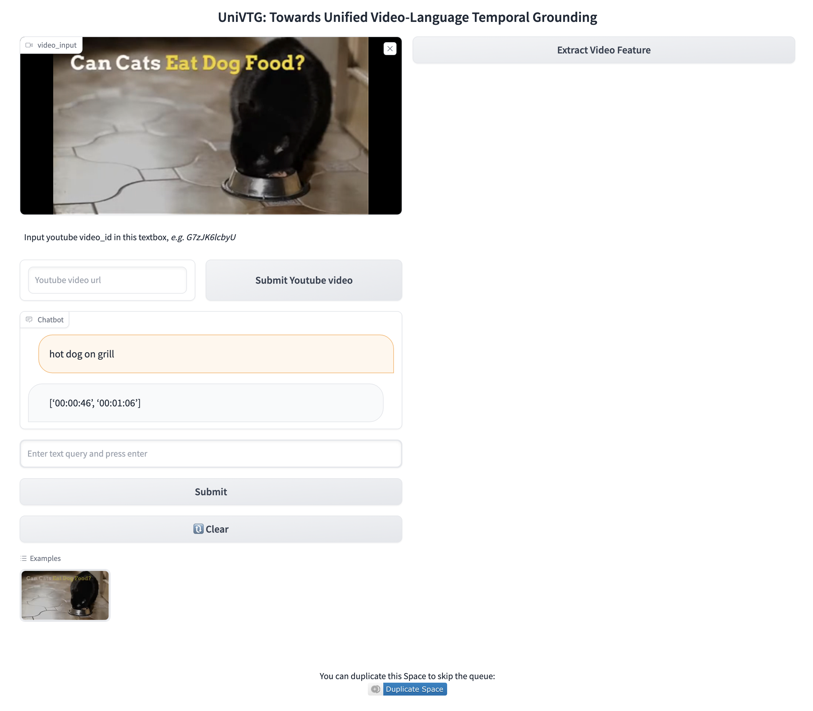

 # UniVTG
> TL; DR: The first video temporal grounding pretraining model, unifying diverse temporal annotations to power moment retrieval (interval), highlight detection (curve) and video summarization (point).



### **News**
<!--  -->
- [2023.7.31] We release the codes, checkpoints and gradio demo.

## 🌟 Run on your examples
To power practical usage (e.g., efficiently grounding on own videos), 
we release the following checkpoints:

| Video Enc.  | Text Enc.  | Pretraining            | Fine-tuned   |  Download |
| ------------------ |  ------------------ | ------------------ | ------- | ---- |
| CLIP-B | CLIP-B | 4M      | -      |   [Drive](https://drive.google.com/drive/folders/1-eGata6ZPV0A1BBsZpYyIooos9yjMx2f?usp=sharing)  |
| CLIP-B | CLIP-B | 4M | QVHL + Charades + NLQ + TACoS + ActivityNet + DiDeMo      |  [Drive](https://drive.google.com/drive/folders/1l6RyjGuqkzfZryCC6xwTZsvjWaIMVxIO?usp=sharing)  


Additionally, we've built gradient interfaces for easy interaction. Run `python3 main_gradio.py`




## 🔨 Preparation

### Environment

```bash
git clone https://github.com/showlab/UniVTG
cd UniVTG

conda create --name univtg python=3.8
pip install -r requirements.txt
```

### Datasets

TBD

<!-- 1.  Download the necessary files for pertaining and downstream datasets. (If you don't need pretraining, just download the downstream one).

| Dataset            | Task    |  GDrive |
| ------------------ | ------- | ---- |
| Point (Ego4D)      | PT      |      |
| Interval (VideoCC) | PT      |      |
| Curve (VideoCC)    | PT      |      |
| QVHighlights       | MR + HL |      |
| Charades-STA       | MR      |      |
| NLQ                | MR      |      |
| TACoS              | MR      |      |
| YoutubeHL          | HL      |      |
| TVSum              | HL      |      |
| QFVS               | VS      |      |

Unzip the downloaded tar

```
tar -xvf qfvs.tar
mv data/home/qinghonglin/univtg/data/{dset_name}/* .
```

2. Prepare the dataset in the following structur
   ```bash
   univtg
   ├── eval
   ├── data
   │   └── qvhighlights
   │       ├── metadata
   │       │   ├──qvhighlights_test.jsonl
   │       │   ├──qvhighlights_train.jsonl
   │       │   └──qvhighlights_val.jsonl
   │       ├── txt_clip
   │       ├── vid_clip
   │       └── vid_slowfast
   ├── main
   ├── model
   ├── utils
   ├── README.md
   └── ···
   ``` -->


### Model Zoo
TBD

## Acknowledgement

This codebase is based on [moment_detr](https://github.com/jayleicn/moment_detr), [HERO_Video_Feature_Extractor](https://github.com/linjieli222/HERO_Video_Feature_Extractor), [UMT](https://github.com/tencentarc/umt).

We thank the authors for their open-source contributions.
